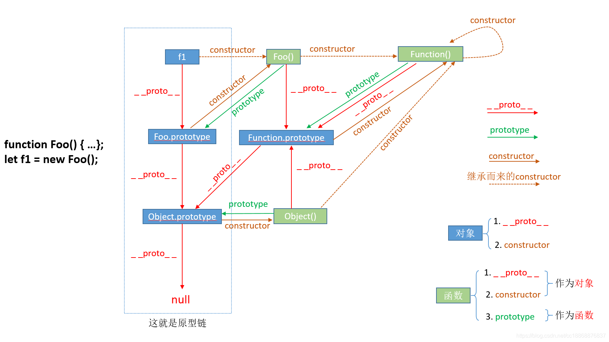

# 原型链 \_\_proto\_\_

图例说明：



## \_\_proto\_\_

1. **对象**所独有。
2. 由一个对象指向一个对象(指向其构造函数的 prototype)。
3. 当访问一个对象属性时,如果对象内部不存在这个属性, 则会去它的\_\_proto\_\_属性所指向的那个对象 (父对象) 里找, 如果还未找到则继续向其父对象的\_\_proto\_\_上寻找，直到原型链顶端 null.
   以上这种通过\_\_proto\_\_属性来连接对象直到 null 的一条链即为 **原型链**。

示例

```js
Function.prototype.test = "Function";
Object.prototype.test = "Objetc";

function Foo() {
    this.name;
}

Foo.prototype.user = "swallowJ";

const f = new Foo();

console.log(f.__proto__, Foo.prototype, Foo.__proto__);
console.log(f.user, f.test);

`
{ user: 'swallowJ' } { user: 'swallowJ' } { test: 'Function' }
swallowJ Objetc
`;
```

## prototype

1. 函数所独有
2. 从一个函数指向一个对象， 即函数的原型对象。
3. 作用：包含可以由特定类型的所有实例共享的属性和方法，即让该函数所实例化的对象都可以找到公用的属性和方法。**任何函数在创建的时候，其实会默认同时创建该函数的 prototype 对象**。

## constructor

1. 对象独有
2. 一个对象指向一个函数， 即该对象的构造函数。
