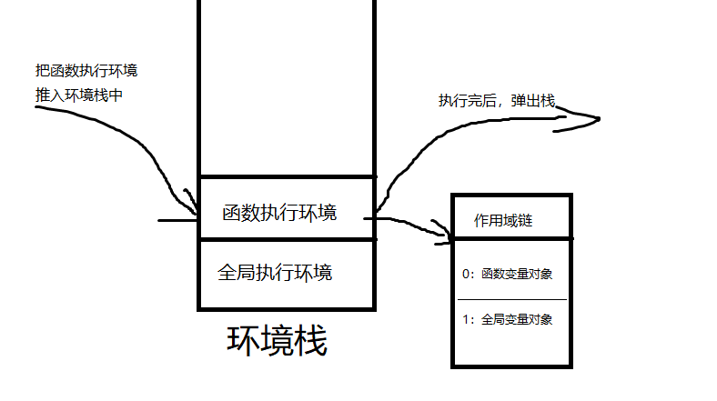

# 闭包原理

1. 全局执行环境: 最外层的执行环境，在 web 中全局执行环境为 window 对象，所以在全局环境中创建的变量和函数都是对象的属性和方法
2. 函数执行环境: 函数体
3. 块级执行环境: 块级定义区域

```js
// 全局执行环境
// .....
{
    // 块级执行环境
    // 代码 ....
}

function func() {
    // 函数执行环境
    //...
}
```

4. 变量对象: 每一个执行环境具有一个与之关联的**变量对象**, 变量对象中存储当前环境中定义的变量与函数。在使用变量或函数时，
   都是在变量对象上去寻找成员。这个对象无法访问，但是可以在作用域[scope]中查看到所定义的成员

5. 环境栈: 每个函数或块都有自己的执行环境。当执行流进入一个函数时，函数的环境就会被推入 "环境栈"中。函数执行完后，栈将其弹出并销毁变量对象，然后把控制权返回在给之前的执行环境。**如果内执行环境的变量对象，被外部执行环境引用，那么内部环境变量对象就无法被销毁(如: 闭包)**

6. 作用域链
   作用域链时一个列表，存储着与执行环境相关的变量对象，通过[scope]属性可查看变量对象列表
   
